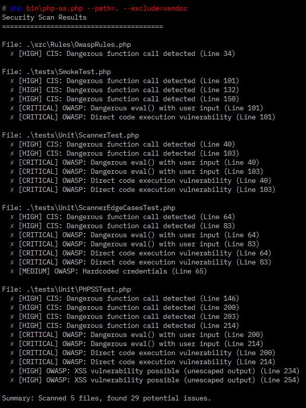
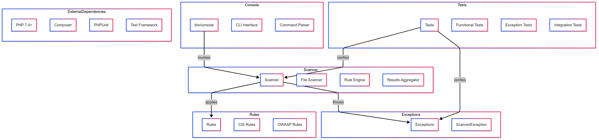
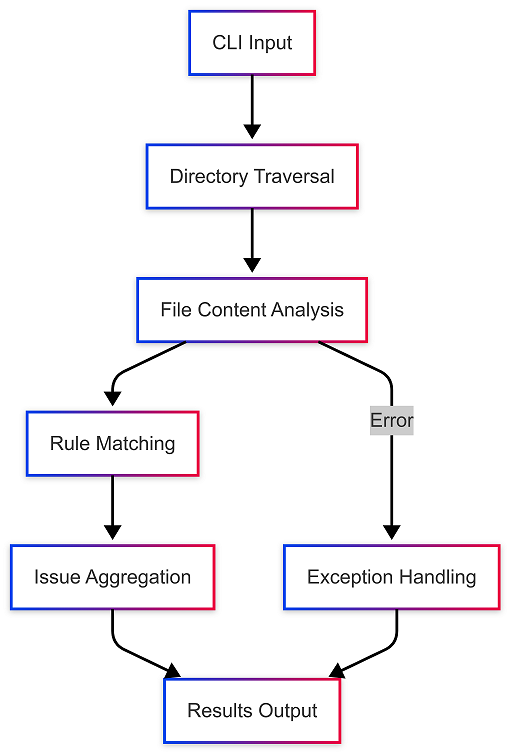

# PHP Security Linter (Beta)

A PHP tool to lint PHP files for security issues based on CIS and OWASP best practices.

[](https://packagist.org/packages/yousha/php-security-linter) [](https://github.com/Yousha/php-security-linter/actions/workflows/main.yml) [](https://github.com/Yousha/php-security-linter/actions/workflows/github-code-scanning/codeql) [](https://github.com/Yousha/php-security-linter/actions/workflows/dependabot/dependabot-updates) [](https://php.net/) [](https://github.com/yousha/php-security-linter/issues)  [](LICENSE) [](CONTRIBUTING.txt)

## Contents

* [Overview](#overview)
* [Features](#features)
* [Requirements](#requirements)
* [Installation](#installation)
* [Usage](#usage)
* [FAQ](#faq)
* [Support](#support)
* [Changelog](#changelog)
* [ToDo](#todo)
* [Contributing](#contributing)
* [Code of Conduct](#code-of-conduct)
* [DCO](#dco)
* [Contributors](#contributors)
* [Notice](#notice)
* [License](#license)

## Overview

PHP Security Linter is a static analysis tool designed to identify security vulnerabilities in PHP code by enforcing CIS benchmarks and OWASP Top 10 standards. Built for developers and security teams, this linter scans codebases without execution(SAST) to detect risks like SQL injection, XSS, misconfigurations, and sensitive data exposure before they reach production.

## Features

* **200+ vuilt-in security rules**:
  * Injection flaws (SQLi, Command, LDAP)
  * Cryptographic weaknesses
  * XSS and SSRF vulnerabilities
  * Security misconfigurations
  * Sensitive data exposure
  * API security risks
  * Cloud misconfigurations
* **Multi-Standard support**:
  * CIS PHP Benchmark v3.0
  * OWASP Top 10 2021
  * Custom rule sets
* **Fast static analysis** without executing code
* **Multiple output formats** (Console, JSON)
* **Configurable ruleset**
* **DevSecOps ready** CI/CD pipeline integration
* **Exclusion support** for ignoring specific paths
* **Supported PHP:** 7.4, 8.3
* **Supported platforms:** Windows, GNU/Linux, MacOS

## Requirements

1. PHP 7.4 or PHP 8.3
2. Composer >= 2

### Versions

| Package version | Branch name       | PHP version | Status         |
|-----------------|-------------------|-------------|----------------|
| dev-main        | `main`            | 8.3         | Active         |
| 3.*             | `main`            | 8.3         | Active         |
| dev-main-php7.4 | `main-php7.4`     | 7.4         | Maintenance    |
| 2.*             | `main-php7.4`     | 7.4         | Maintenance    |
| 1.*             |                   | 5.6         | EOL            |

* **Active**: Full support
* **Maintenance**: Critical/Security fixes only
* **EOL**: Unsupported

_The version of package that gets installed is automatically selected by Composer based on current installed PHP version._

## Screenshots



## Diagrams

* Component diagram:



* Dataflow diagram:



## Installation

Via [Composer](https://getcomposer.org/):

```shell
composer require --dev yousha/php-security-linter
```

Or Composer global installation:

```shell
composer global require yousha/php-security-linter
```

## Usage

Lint current directory:

```shell
php vendor/bin/php-sl --path=.
```

Or (Windows):

```shell
vendor\bin\php-sl.bat --path=.
```

Lint a directory:

```shell
php vendor/bin/php-sl --path=./src
```

Lint with path exclusion:

```shell
php vendor/bin/php-sl --path=./app --exclude=storage,tests
```

Excluding a specific directory, path exclusion, and rule exclusion:

```bash
php bin/php-sl.php --path=./src --exclude=storage --exclude-rules=CIS-003,OWASP-001
```

JSON output:

```shell
php vendor/bin/php-sl --path=./public --format=json
```

### Command options

| Option       | Description                      |
| ------------ | -------------------------------- |
| `-p, --path` | Path to scan (required)          |
| `--exclude`  | Comma-separated paths to exclude |
| `--exclude-rules` | Comma-separated rule IDs to ignore |
| `--help`     | Show help message                |

### Example console output

```shell
Scan Results
========================================

File: /src/auth.php
  ✗ [CRITICAL] OWASP: SQL Injection vulnerability detected (Line 42)
  ✗ [HIGH] CIS: Hardcoded database credentials (Line 15)

File: /src/utils.php
  ✗ [MEDIUM] OWASP: XSS vulnerability possible (Line 88)

Summary: Scanned 24 files, found 3 potential issues.
```

### QA test

Run tests to ensure everything works as expected:

```shell
composer test
```

Or:

```shell
vendor/bin/phpunit tests/
```

## FAQ

See [FAQ.txt](FAQ.txt) file.

## Support

For any question, issues and feature requests, [open an issue.](https://github.com/yousha/php-security-linter/issues).

## Changelog

See [CHANGELOG.txt](CHANGELOG.txt) file.

## ToDo

See [TODO.txt](TODO.txt) file.

## Contributing

Contributions are welcome! Please follow these steps:

1. Fork repository.
2. Create a new branch for your feature or bugfix.
3. Submit a pull request with a detailed description of your changes.

For more details see [CONTRIBUTING.txt](CONTRIBUTING.txt).

## Code of Conduct

See [CODE_OF_CONDUCT.txt](CODE_OF_CONDUCT.txt) file.

## DCO

See [DCO.txt](DCO.txt) file.

## Contributors

See [CONTRIBUTORS.txt](CONTRIBUTORS.txt) file.

## Notice

See [NOTICE.txt](NOTICE.txt) file.

## License

This open-source software is distributed under the GPL-3.0 license. See [LICENSE](LICENSE) file.
