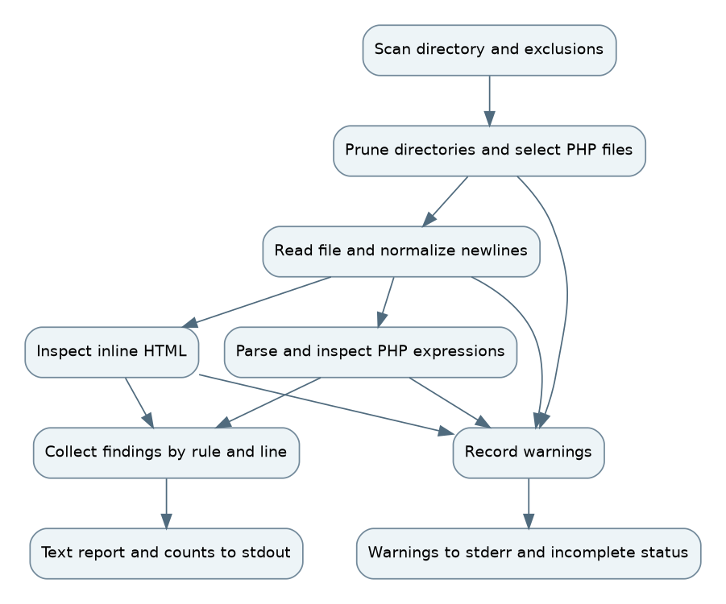

# PHP Security Linter (Beta)

A PHP tool to lint PHP files for security issues based on CIS and OWASP best practices.

[](https://packagist.org/packages/yousha/php-security-linter) [](https://github.com/Yousha/php-security-linter/actions/workflows/main.yml) [](https://github.com/Yousha/php-security-linter/actions/workflows/github-code-scanning/codeql) [](https://github.com/Yousha/php-security-linter/actions/workflows/dependabot/dependabot-updates) [](https://php.net/) [](https://github.com/yousha/php-security-linter/issues)  [](LICENSE) [](CONTRIBUTING.txt)

## Contents

* [Overview](#overview)
* [Features](#features)
* [Requirements](#requirements)
* [Installation](#installation)
* [Usage](#usage)
* [FAQ](#faq)
* [Support](#support)
* [Changelog](#changelog)
* [ToDo](#todo)
* [Contributing](#contributing)
* [Code of Conduct](#code-of-conduct)
* [DCO](#dco)
* [Contributors](#contributors)
* [Notice](#notice)
* [License](#license)

## Overview

PHP Security Linter is a static analysis tool designed to identify security vulnerabilities in PHP code using CIS- and OWASP-oriented checks and optional MITRE ATT&CK behavior indicators. Built for developers and security teams, this linter scans codebases without execution(SAST) to detect risks like SQL injection, XSS, misconfigurations, and sensitive data exposure before they reach production.

## Features

* **48 registered rules** across 16 CIS, 29 OWASP, and 3 optional MITRE ATT&CK checks.
* **Fast static analysis** without executing code
* **Console output** with file-level findings and scan summary
* **SARIF 2.1.0 output** for interoperable security findings and CI/CD integrations
* **Configurable ruleset**
* **DevSecOps ready** CI/CD pipeline integration
* **Exclusion support** for ignoring specific paths
* **Supported PHP:** 8.0 and newer
* **Supported platforms:** Windows, GNU/Linux, MacOS

## Requirements

1. PHP 8.0 or newer with PCRE and tokenizer
2. Composer 2 or newer

### PHP Compatibility

The current `main` branch (`dev-main`) requires PHP 8.0 or newer. Published 3.x tags retain their original Composer requirements.

| Package version | Branch name       | PHP version | Status      |
|-----------------|-------------------|-------------|-------------|
| dev-main        | `main`            | 8.0+        | Active      |
| 3.* (released)  | `main`            | Per tag     | Active      |
| dev-main-php7.4 | `main-php7.4`     | 7.4         | Maintenance |
| 2.*             | `main-php7.4`     | 7.4         | Maintenance |
| 1.*             |                   | 5.6         | EOL         |

* **Active**: Full support
* **Maintenance**: Critical and security fixes only
* **EOL**: Unsupported

The PHP 7.4 and PHP 5.6 entries refer only to older release lines; they are not supported by the current `main` branch or 3.x releases.

To install the PHP 8.0-compatible branch before a tagged release, run `composer require --dev yousha/php-security-linter:dev-main`.

## Screenshots


## Diagrams

* Component diagram:


* Dataflow diagram:



## Installation

Via [Composer](https://getcomposer.org/) per project:

```shell
composer require --dev yousha/php-security-linter
```

Or via [Composer](https://getcomposer.org/) globally:

```shell
composer global require yousha/php-security-linter
```

## Usage

Lint current directory:

```shell
php vendor/bin/php-sl --path=.
```

Or (Windows):

```shell
vendor\bin\php-sl.bat --path=.
```

Lint a directory:

```shell
php vendor/bin/php-sl --path=./src
```

Lint with path exclusion:

```shell
php vendor/bin/php-sl --path=./app --exclude=storage,tests
```

Excluding a specific directory, path exclusion, and rule exclusion:

```bash
php bin/php-sl --path=./src --exclude=storage --exclude-rules=CIS-003,OWASP-001
```


Generate a SARIF 2.1.0 report and write it to a file:

```shell
php vendor/bin/php-sl --path=./src --format=sarif --output=results.sarif
```

Write SARIF to standard output:

```shell
php vendor/bin/php-sl --path=./src --format=sarif > results.sarif
```

The default `text` format remains unchanged. SARIF output includes rule descriptors, severity levels, source file URIs, line locations, and scan warnings as invocation notifications.

### OWASP and MITRE ATT&CK checks

A default scan runs 45 rules. Use `--include-attack` to enable all 48. Library callers can pass `new Linter(includeAttack: true)`. Exclude individual rule IDs with `--exclude-rules`.

| Rule | Finding | Guidance |
|---|---|---|
| OWASP-020 | Session strict mode explicitly disabled | [PHP Configuration](https://cheatsheetseries.owasp.org/cheatsheets/PHP_Configuration_Cheat_Sheet.html) |
| OWASP-021 | URL-based session IDs explicitly enabled | [PHP Configuration](https://cheatsheetseries.owasp.org/cheatsheets/PHP_Configuration_Cheat_Sheet.html) |
| OWASP-022 | Cookie-only session IDs explicitly disabled | [PHP Configuration](https://cheatsheetseries.owasp.org/cheatsheets/PHP_Configuration_Cheat_Sheet.html) |
| OWASP-023 | SameSite=None cookie explicitly disables Secure | [Session Management](https://cheatsheetseries.owasp.org/cheatsheets/Session_Management_Cheat_Sheet.html) |
| OWASP-024 | __Host- cookie sets a Domain attribute | [Session Management](https://cheatsheetseries.owasp.org/cheatsheets/Session_Management_Cheat_Sheet.html) |
| OWASP-025 | __Host- cookie specifies a path other than / | [Session Management](https://cheatsheetseries.owasp.org/cheatsheets/Session_Management_Cheat_Sheet.html) |
| OWASP-026 | Startup error display enabled; review production configuration | [PHP Configuration](https://cheatsheetseries.owasp.org/cheatsheets/PHP_Configuration_Cheat_Sheet.html) |
| OWASP-027 | HTML error display enabled; review production configuration | [PHP Configuration](https://cheatsheetseries.owasp.org/cheatsheets/PHP_Configuration_Cheat_Sheet.html) |
| OWASP-028 | Exception traces include arguments; review production configuration | [PHP Configuration](https://cheatsheetseries.owasp.org/cheatsheets/PHP_Configuration_Cheat_Sheet.html) |
| OWASP-029 | Explicit bcrypt cost below the OWASP minimum of 10 | [Password Storage](https://cheatsheetseries.owasp.org/cheatsheets/Password_Storage_Cheat_Sheet.html) |
| ATTACK-001 | Review execution of directly Base64-decoded literal content | [T1140](https://attack.mitre.org/techniques/T1140/) |
| ATTACK-002 | Review remote content copied directly to a script file | [T1105](https://attack.mitre.org/techniques/T1105/) |
| ATTACK-003 | Review literal schedule written to a cron configuration file | [T1053.003](https://attack.mitre.org/techniques/T1053/003/) |

These checks inspect direct PHP calls and literal positional arguments. Cookie and hashing options use literal arrays. The diagnostics checks target production settings. ATT&CK matches identify code for review, including legitimate installers and scheduled maintenance. The scanner does not execute the code or trace values across assignments.

### Exit codes

| Code | Meaning |
|------|---------|
| 0 | Clean scan |
| 1 | One or more findings |
| 2 | Invalid CLI input or scan error |
| 3 | Fatal error |
| 4 | One or more files/directories could not be scanned |

### Cross-platform notes

- Line endings are normalized (CRLF → LF) before rule matching.
- Path exclusion is case-insensitive.
- Absolute paths (`/…` and `X:\…`) and mixed separators are handled.
- On Windows use `vendor\bin\php-sl.bat` (Composer wrapper).

### Commands

| Option       | Description                      |
| ------------ | -------------------------------- |
| `-p, --path` | Path to scan (required)          |
| `--exclude`  | Comma-separated paths to exclude |
| `--exclude-rules` | Comma-separated rule IDs to ignore |
| `--include-attack` | Enable three MITRE ATT&CK review rules |
| `--list-rules` | List available rule IDs |
| `--format` | Output format: `text` (default) or `sarif` |
| `--output` | Write SARIF output to a file (requires `--format=sarif`) |
| `--help`     | Show help message                |

### Example output

```shell
Scan Results
========================================

File: /src/auth.php
  ✗ [CRITICAL] OWASP: SQL Injection vulnerability detected (Line 42)
  ✗ [HIGH] CIS: Hardcoded database credentials (Line 15)

File: /src/utils.php
  ✗ [MEDIUM] OWASP: XSS vulnerability possible (Line 88)

Summary: Scanned 24 files, found 3 potential issues.
```

### QA/QC test

Run tests to ensure everything works as expected:

```shell
composer test
```

Or:

```shell
vendor/bin/phpunit tests/
```

## FAQ

See [FAQ.txt](FAQ.txt) file.

## Support

For any question, issues and feature requests, [open an issue.](https://github.com/yousha/php-security-linter/issues).

## Changelog

See [CHANGELOG.txt](CHANGELOG.txt) file.

## ToDo

See [TODO.txt](TODO.txt) file.

## Contributing

Contributions are welcome! Please follow these steps:

1. Fork repository.
2. Create a new branch for your feature or bugfix.
3. Submit a pull request with a detailed description of your changes.

For more details see [CONTRIBUTING.txt](CONTRIBUTING.txt).

## Code of Conduct

See [CODE_OF_CONDUCT.txt](CODE_OF_CONDUCT.txt) file.

## DCO

See [DCO.txt](DCO.txt) file.

## Contributors

See [CONTRIBUTORS.txt](CONTRIBUTORS.txt) file.

## Notice

See [NOTICE.txt](NOTICE.txt) file.

## License

This open-source software is distributed under the GPL-3.0 license. See [LICENSE](LICENSE) file.
